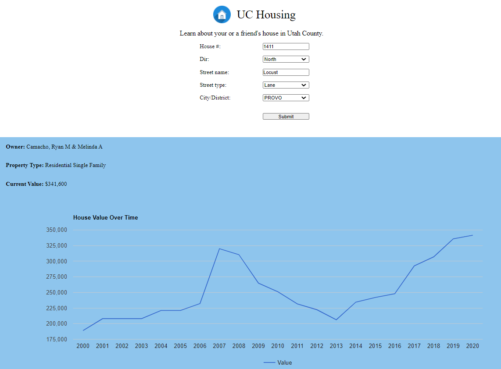

# Utah County Housing

This uses information that Utah County puts out to show real estate information for your house in a cleaner format. The search feature is a little awkward because it is taken
from <http://www.utahcounty.gov/LandRecords/AddressSearchForm.asp>.

## Installation Steps

Either download the repository, or run the command

    git clone https://github.com/programjames/utahcountyhousing.git

Open the `index.html` file. You're good to go!

## Example

